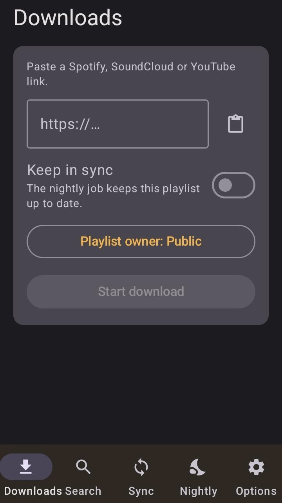
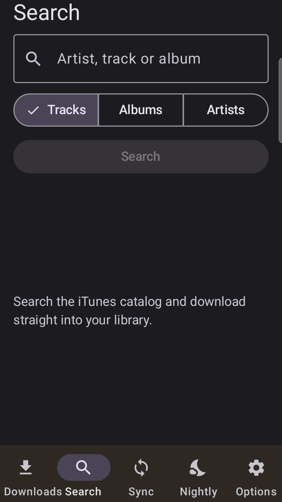
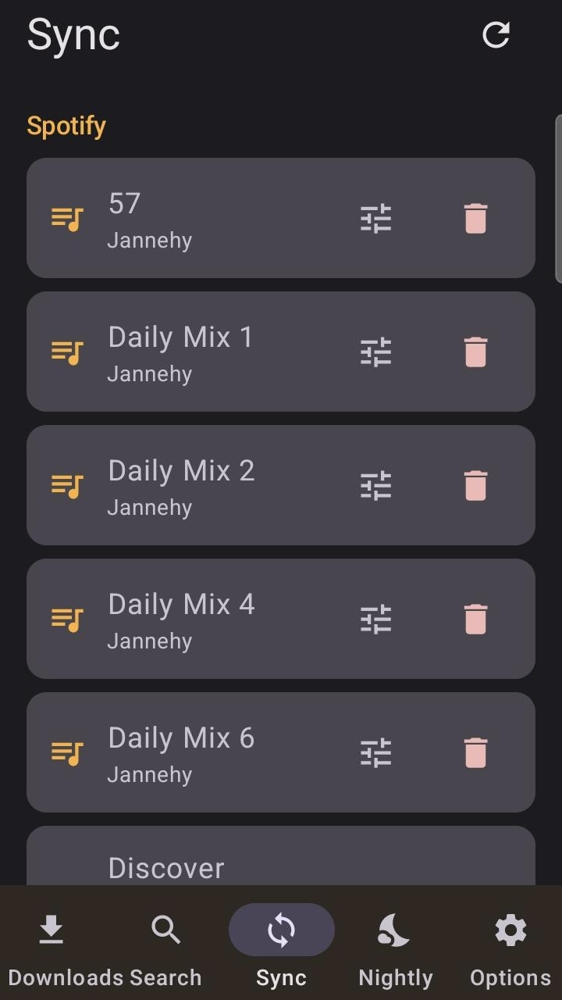
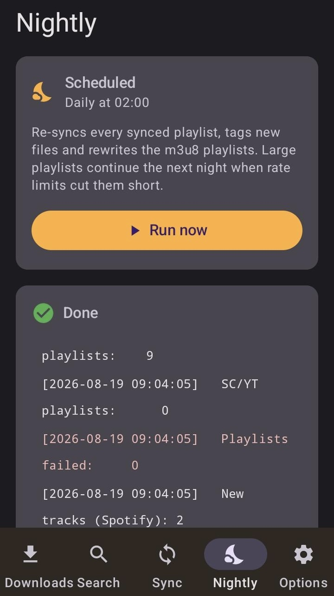

# Nightshift for Android

A native Jetpack Compose client for a
[Nightshift](https://github.com/Jannehy/nightshift) server — your self-hosted
music library, from your pocket.

<p align="center">
  
  
  
  
</p>

## What it does

| Screen | What you get |
|---|---|
| **Downloads** | Paste a Spotify, SoundCloud or YouTube link, pick a Navidrome owner, mark it for nightly sync, and watch the download live |
| **Search** | The iTunes catalog as an artwork grid with 30-second previews — one tap pulls a track or a whole album into your library |
| **Sync** | Every playlist the nightly job keeps up to date, grouped by source; admins set owner and visibility |
| **Nightly** | The schedule in plain language, a manual run, and its own live log |
| **Settings** | Account and password, user management, the full server configuration, accent colour |

German and English, following the device language. The accent colour has eight
presets, defaulting to the web UI's own orange — bright on dark backgrounds,
deeper on light ones, the same two tones the day and night themes use.

## What you need

- A phone with **Android 8.0** (API 26) or newer
- A **Nightshift server** you can reach from the phone — on your home network or
  through a VPN such as Tailscale or WireGuard. Version **1.3 or newer** is
  recommended: from that release the download log is per user, so you no longer
  watch someone else's run.

## Installing

Google Play does not allow apps that download media from third-party services,
so Nightshift is distributed as an APK — which on Android installs on any device
without re-signing.

1. Download `nightshift.apk` from the [latest release](../../releases/latest).
2. Open it on the phone. Android asks once whether this source may install apps;
   allow it for your browser or file manager.
3. That is it. The APK is signed, so updates install straight over the previous
   version.

Over a cable it is one command:

```bash
adb install -r nightshift.apk
```

## Connecting

On first launch, enter the address of your server:

| Typed | Used |
|---|---|
| `192.168.1.20` | `http://192.168.1.20:8765` |
| `192.168.1.20:9000` | that port instead of the default |
| `nightshift.tail1234.ts.net` | over Tailscale, with the tunnel up |
| `https://music.example.com` | taken as typed, port 443 |

A bare host gets `http://` and Nightshift's default port `8765`; anything more
explicit is used as you typed it, path prefix included.

The app speaks plain HTTP, because that is how Nightshift is normally reached
over a private tunnel or the local network — `network_security_config.xml`
permits cleartext for that reason. Behind an HTTPS reverse proxy, enter the full
`https://` URL and that exception can be narrowed or dropped.

Sign in with your Nightshift account. The session survives restarts, and the
password goes into `EncryptedSharedPreferences` so the app can sign in again by
itself when the session expires.

## Building from source

Only needed if you want to change something — for installing, use a release.

```bash
export ANDROID_HOME=/path/to/android-sdk
./gradlew assembleDebug     # app/build/outputs/apk/debug/app-debug.apk
./gradlew assembleRelease   # signed, if keystore.properties is present
```

Android Studio is not required; the Gradle wrapper and the command line
SDK tools are enough, on Linux as well as macOS.

A release build is signed when `keystore.properties` sits next to
`settings.gradle.kts`:

```properties
storeFile=nightshift-release.jks
storePassword=…
keyAlias=nightshift
keyPassword=…
```

That file and the `.jks` are kept out of git — and must be backed up. An update
can only install over an existing app if it carries the same signature. Without
the file, the release build simply comes out unsigned.

The launcher icon and the mark drawn inside the app come from one place:
`tools/make-icon.py --android app/src/main/res` rasterises the icons including
the adaptive foreground layer, and `--swift` prints the same geometry as
constants for `ui/Mark.kt`, so the two cannot drift apart.

## Licence

[MIT](LICENSE)
